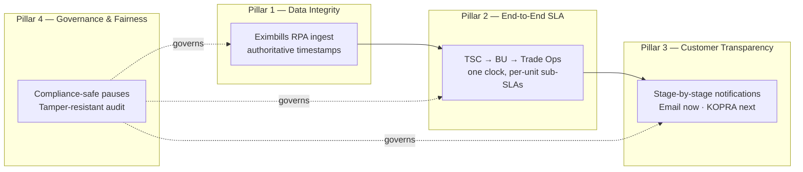
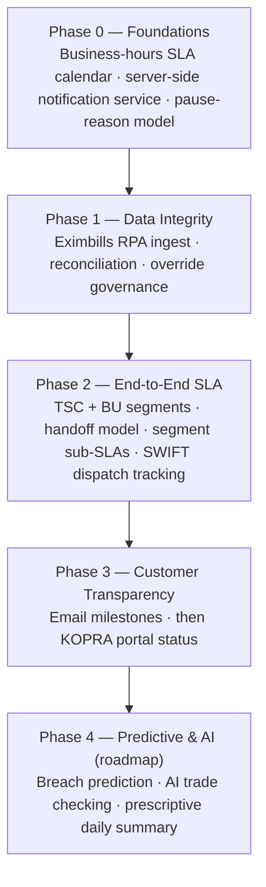
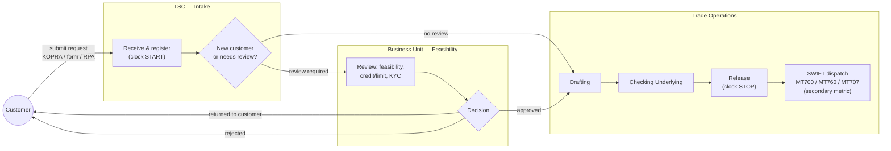
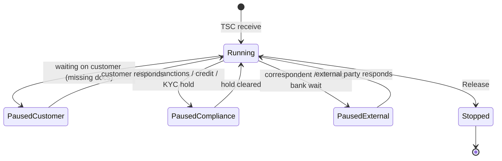
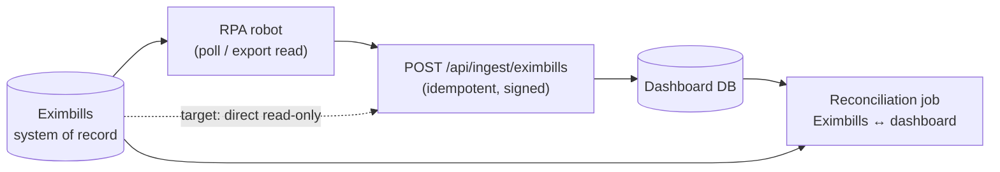

# End-to-End Trade SLA — Improvement Plan
## From Trade-Operations SLA to an End-to-End Customer Commitment

> **Internal name:** SHILA / TOS SLA Dashboard — Trade Operations Surabaya
> **Prepared for:** Business Transformation 2026
> **Document type:** Improvement plan + business case (strategy) with technical design
> **Status:** Draft for review

---

## 0. Document Control

| Item | Value |
| --- | --- |
| Version | 0.1 (draft) |
| Date | 2026-07-19 |
| Owner | Zahra Ashiela Maghdiyyah — Sign Officer Import, Trade Operations Surabaya |
| Related docs | `references/prd.md` (As-Built PRD v4.0), SHIELA Business Transformation deck |
| Scope | Extend the proven Trade-Operations SLA tracker into an end-to-end, tamper-resistant, customer-transparent trade service commitment |

### Decisions locked for this draft (confirmed with owner)

1. **Audience:** both — management strategy first, build-team technical design second.
2. **Committed SLA clock:** starts at **TSC receipt**, stops at **Trade Ops Release**. SWIFT MT700/MT760/MT707 dispatch & ACK are tracked as a **secondary quality metric**, not part of the committed clock.
3. **Business Unit review:** measured by **handoff markers only** (`Forwarded to BU` → `BU Approved / Returned`), with a sub-SLA computed between those two stamps.
4. **Clock pauses:** the clock **pauses for both** customer-caused waits and compliance holds. **Hard principle: the SLA must never pressure a compliance decision.**
5. **System of record for timestamps:** **Eximbills** (China Systems) — surfaced via RPA now, direct integration as target state.

> Assumptions that still need confirmation are collected in **Appendix C**. Nothing below is blocked on them; they are flagged inline as `⚠ ASSUMPTION`.

---

# PART A — STRATEGY & BUSINESS CASE

## 1. Executive Summary

The TOS SLA Dashboard has already delivered a rare, measurable transformation: **SLA compliance rose from 23% to 99%**, with **3,915 transactions tracked end-to-end** across **23 team members and three process lines** (Import L/C, Export Document, Bank Guarantee). It is live on Mandiri's internal server and accessed directly from Mandiri PCs.

That success covers **one segment** of the customer's journey — Trade Operations processing. The customer, however, experiences the **whole journey**: from the moment they submit a request, through business-unit feasibility review, to the moment their L/C or SKBDN is issued over SWIFT. Today that whole journey is neither measured nor communicated. Two risks follow:

1. **Integrity risk.** SLA milestones are advanced by a manual click. A minority of users have clicked *Start* immediately before *Complete* to "make" the SLA. This quietly corrupts the very number the transformation is built on. If leadership ever discovers the 99% is partly gamed, the credibility of the entire program collapses.
2. **Blind-spot risk.** The bank commits to a service level it cannot see end-to-end and cannot prove to the customer. When a high-value corporate L/C is late, the customer finds out by complaint — the worst possible way — and the bank's reputation absorbs the damage.

This plan closes both gaps with four pillars:

| Pillar | What it does | Primary value |
| --- | --- | --- |
| **1. Data Integrity** | Replace manual "Start" clicks with **authoritative timestamps pulled from Eximbills** via RPA | Makes the 99% *trustworthy* — protects the program's credibility |
| **2. End-to-End SLA** | Extend measurement across **TSC → Business Unit → Trade Operations** as one clock with per-unit sub-SLAs | A single, honest service commitment the bank can stand behind |
| **3. Customer Transparency** | Proactive **stage-by-stage notifications** (email now, KOPRA portal next) | Turns a black box into a visible, reassuring experience |
| **4. Governance & Fairness** | Compliance-safe clock pauses, tamper-resistant audit, fair staff evaluation | Directly reduces **reputational risk** and satisfies audit/regulator |

None of this is a rebuild. The architecture is already "smart middleware, not from scratch." This plan extends it.

## 2. Alignment with Bank Mandiri's Vision

> **Director of Operations (Pak Timothy):** *"Peningkatan kualitas service ke nasabah"* — improving the quality of service to customers.

An SLA that is **kept** is a service promise genuinely honored — not merely an internal target. This plan operationalizes the vision along three threads the bank explicitly cares about:

- **Best service to the customer.** The customer stops chasing the bank for updates; the bank proactively tells them where their transaction stands and when it will be done. Risk-based triage means the transactions that matter most to the relationship finish first.
- **A transparent and committed process.** "Transparent" means the customer can see progress; "committed" means the bank measures the *whole* promise (not just the easy middle) and holds itself accountable at every handoff. A commitment you can't measure end-to-end isn't a commitment — it's a hope.
- **Protecting the bank's reputation.** Trade finance customers are high-value corporates. A single mishandled or silently-late L/C can damage a relationship built over years and expose the bank to reputational — and sometimes regulatory — consequence. This plan converts late-discovery-by-complaint into early-detection-and-recovery.

## 3. Where We Are Today (Proven Base)

The existing product (see `references/prd.md`) already delivers:

- Lifecycle tracking for Import / Export / Bank Guarantee with configurable per-type SLAs (targets: Import L/C ≤ 90 min, Export L/C ≤ 90 min, Bank Guarantee ≤ 60 min).
- One-click status transitions with automatic timestamps; exception handling that excludes external delay from the SLA.
- Executive dashboard, stage-duration analytics, bottleneck detection, staff/officer performance.
- Proactive early warning at 75% / 90% of the SLA budget (in-app modal + notification bell).
- Real-time updates over SSE; period-over-period SLA comparison.
- Three n8n AI automations (on-demand summary, 10-minute early-warning polling, weekly root-cause mining) that already reach Email / Slack / WhatsApp channels — currently disabled.
- Role-scoped access across eight roles and three streams.

**This is the platform we extend — not replace.**

## 4. The Gap (Problem Statement)

| # | Gap | Consequence |
| --- | --- | --- |
| G1 | **Manual "Start" clicks can be gamed** (click Start just before Complete) | The 99% is not fully trustworthy; performance data is corruptible; unfair to honest staff |
| G2 | **SLA covers Trade Operations only** | The bank measures ~1/3 of the journey the customer actually feels |
| G3 | **No visibility of the TSC intake and Business-Unit review segments** | Handoff delays are invisible; "where is my L/C stuck?" is unanswerable |
| G4 | **Customer is not proactively informed** | Customer learns of delay by complaint → reputational damage, relationship strain |
| G5 | **SWIFT dispatch not linked to release** | "Released" in the tool ≠ "issued to the beneficiary" on the network; a silent gap can hide real delay |
| G6 | **No structured distinction between bank-caused, customer-caused, and compliance-hold delay across units** | Unfair evaluation; risk that SLA pressure leaks into compliance decisions |

## 5. Reputational-Risk Lens

Reputational risk in trade finance materializes when the bank **fails a commitment the customer was counting on**, or when **internal metrics can't be trusted** by leadership, audit, or the regulator. This plan reduces it on both fronts:

| Reputational-risk driver | Mitigation in this plan | Pillar |
| --- | --- | --- |
| Late issuance of a high-value corporate L/C, discovered by complaint | End-to-end early warning + risk-based triage; proactive customer notification | 2, 3 |
| Metrics quietly gamed → leadership/audit loses trust in the program | Authoritative Eximbills timestamps; tamper-resistant audit; segregation of duties on overrides | 1, 4 |
| SLA pressure rushing an AML / sanctions / credit decision | Hard rule: compliance holds **pause** the clock and never count against it | 4 |
| "Released" in the tool but not actually sent over SWIFT | SWIFT dispatch/ACK tracked as a secondary quality metric with its own alert | 2 |
| Customer confusion / distrust from silence | Plain-language, stage-by-stage updates through governed channels | 3 |
| Sensitive trade data leaking via email | Notifications carry *milestones only*, no confidential terms; detail lives behind KOPRA login | 3, 4 |

## 6. Strategic Objectives & Guiding Principles

**Objectives**

1. Make every SLA number **trustworthy by construction** (sourced from the system of record).
2. Measure and commit to the **end-to-end** journey, with clear per-unit accountability.
3. Keep the customer **proactively informed** in plain language.
4. **Reduce reputational risk** by detecting and recovering from at-risk transactions before they become complaints.
5. Do all of this **without adding operational workload** — the tool must remain "the right tool, not extra work."

**Guiding principles (non-negotiable)**

- **P1 — Compliance over SLA, always.** No metric, alert, or dashboard may pressure an AML / sanctions / credit / KYC decision. Compliance holds pause the clock.
- **P2 — System of record wins.** Where Eximbills and a manual entry disagree, Eximbills is authoritative; the discrepancy is logged, never silently overwritten.
- **P3 — Fair measurement.** Time the bank does not control (customer waits, compliance holds, correspondent-bank waits) is excluded from staff evaluation.
- **P4 — Minimum necessary disclosure.** The customer sees progress milestones, not internal mechanics or confidential terms.
- **P5 — Additive, not disruptive.** Extend the live product; preserve what already works.
- **P6 — On-prem, CPU-only, deterministic-first intelligence.** No data leaves the bank and there is no GPU. All "intelligence" is deterministic rules or small classical ML by default; a language model is optional, self-hosted, CPU-bound, async, and may only *phrase* pre-computed numbers — never compute or invent them. See **Appendix D**.

## 7. The Four Pillars (Overview)

Detailed design for each pillar is in **Part B**.

## 8. Success Metrics

| Metric | Baseline (today) | Target |
| --- | --- | --- |
| End-to-end SLA compliance (TSC→Release) | Not measured | Establish baseline, then ≥ 95% |
| Trade-Ops SLA compliance (existing) | 99% | Maintain ≥ 99%, now **verifiable** |
| % of timestamps sourced from Eximbills (vs manual) | 0% | ≥ 95% within Phase 1 |
| Manual-timestamp overrides per week | Untracked | Tracked, trending to near-zero |
| At-risk transactions caught before breach | Partial (Trade Ops only) | ≥ 90% end-to-end |
| Customers proactively notified per stage | 0% | 100% of eligible transactions |
| Complaints about "no update / where is my L/C" | Untracked | Establish baseline, then reduce |
| Compliance decisions with SLA pressure flagged | N/A | 0 (by design) |

## 9. Roadmap & Phasing

Sequenced so that **credibility is protected first**, then coverage, then customer experience.

| Phase | Outcome | Notes |
| --- | --- | --- |
| **0 — Foundations** | Business-hours/holiday-aware SLA math; server-side notifications; typed pause reasons | Prerequisite for honest E2E numbers |
| **1 — Data Integrity** | 99% becomes *trustworthy*; gaming eliminated | Highest priority — protects the program |
| **2 — End-to-End SLA** | One clock across three units; SWIFT dispatch tracked | The core "commitment" expansion |
| **3 — Customer Transparency** | Proactive plain-language updates | Email first (fast win), KOPRA next |
| **4 — Predictive & AI** | Prediction + document pre-checking | Matches existing roadmap (deck slide 5); **on-prem, CPU-only, deterministic-first** — see **Appendix D** |

## 10. Risks, Dependencies & Assumptions (Strategy-level)

| Risk / dependency | Impact | Mitigation |
| --- | --- | --- |
| Eximbills access (RPA credentials / API / DB view) not granted | Blocks Pillar 1 | Start RPA-based (screen/export read); pursue direct integration as target state; escalate access early |
| TSC & Business Unit are separate org units / systems | Complicates E2E | Start with handoff markers (agreed); no dependency on instrumenting BU internals |
| KOPRA integration requires channel/security approval | Delays Pillar 3 portal step | Ship email milestones first; treat KOPRA as fast-follow |
| Customer emails must go through a governed bank channel (not ad-hoc n8n) | Compliance/brand | Route customer-facing comms through approved bank email infrastructure; n8n for internal alerts only |
| Business-hours/holiday calendar per branch/timezone | Wrong SLA math | Configurable calendar in Phase 0 |
| Over-notifying customers | Notification fatigue, brand harm | Milestone-only + digest option + per-customer preferences |
| **Existing n8n AI workflows target cloud/oversized models** (`qwen3.5:397b`, cloud Gemini) — cannot run on 8c/16GB and violate no-cloud | Automations won't execute; data-egress risk | Rework as on-prem rules/classical-ML jobs (or small CPU SLM, async); keep them calling the Go API + internal Slack/WhatsApp only. See **Appendix D** |

---

# PART B — TECHNICAL DESIGN

## 11. End-to-End Process & SLA Clock Model

### 11.1 The end-to-end flow

### 11.2 Segments and the committed clock

The **committed customer clock** runs from **TSC receipt** to **Trade Ops Release**. It is decomposed into ownership segments, each with its own sub-SLA:

| Segment | Owner | Starts at | Ends at | Sub-SLA source |
| --- | --- | --- | --- | --- |
| **Intake** | TSC | TSC receives/registers | Forwarded to BU **or** to Trade Ops | New config |
| **Review** | Business Unit | Forwarded to BU | BU approved / returned | New config (handoff markers only) |
| **Processing** | Trade Ops | Received by Ops | Release | Existing per-type SLA |
| *(secondary)* SWIFT | Trade Ops / network | Release | MT7xx ACK | Quality metric, separate threshold |

- **Committed E2E budget** = Intake SLA + Review SLA (if applicable) + Processing SLA. When no BU review is required, the Review segment is **skipped** (contributes 0, and is not counted against anyone).
- **SWIFT dispatch** is tracked *after* the committed clock stops: Release → MT7xx ACK. A separate threshold raises an alert if a released transaction has not achieved SWIFT ACK within *X* minutes (⚠ ASSUMPTION: threshold TBD). This closes gap **G5** without changing the committed promise.

### 11.3 Clock state machine (pauses)

- Paused time is **excluded** from the committed clock and from staff evaluation (**P3**).
- **`PausedCompliance` never counts against the SLA and never triggers "hurry up" alerts** (**P1**). It is visible to management as *hold time*, distinctly labeled, so a genuine bottleneck is still seen — but never as an SLA failure of the staff.
- Each pause records a typed reason, who set it, and timestamps — extending today's single-exception model into a **typed, multi-instance pause model** (see §16).

## 12. Pillar 1 — Data Integrity (Eximbills RPA Ingest)

**Goal:** eliminate manual-click gaming (G1) by sourcing lifecycle timestamps from the **system of record**.

### 12.1 Approach

- **Now (Phase 1):** an **RPA robot** reads Eximbills workflow states/exports (screen automation or scheduled export) and **pushes authoritative timestamps** into the dashboard through a new ingest API. This works even if Eximbills exposes no native integration.
- **Target state:** a **direct read-only integration** (Eximbills DB view or API) for near-real-time, higher-precision timestamps. ⚠ ASSUMPTION: access to be confirmed (Appendix C).

### 12.2 Rules

- **Authoritative source (P2):** where an Eximbills-sourced timestamp exists, it **supersedes** any manual one; the manual value is retained in the audit trail as `manualValue` with a `discrepancyMinutes` field.
- **Idempotency:** ingest is keyed by `(eximbillsRef, stage)` so repeated RPA runs don't double-write.
- **Reconciliation:** a scheduled job compares dashboard vs Eximbills daily and raises a discrepancy report (records present in one but not the other; timestamp drift beyond a tolerance).
- **Precision & lag:** RPA polling interval introduces bounded lag; each ingested timestamp carries `sourceCapturedAt` vs `ingestedAt` so precision is transparent. Early-warning math uses `sourceCapturedAt`.
- **Manual entry becomes fallback, not primary.** The queue UI still allows manual transitions when Eximbills has no record yet (e.g., pre-registration), but such timestamps are visibly marked *provisional* until reconciled.

### 12.3 Anti-gaming outcome

Because *Start Drafting* / *Start Checking* / *Release* are now stamped from Eximbills events, clicking them in the UI no longer changes the measured time. The incentive to game disappears, and honest staff are no longer disadvantaged.

## 13. Pillar 2 — End-to-End SLA (TSC → BU → Trade Ops)

### 13.1 New lifecycle statuses

Extend the existing status set with intake/review states (existing Trade-Ops statuses unchanged):

- `Submitted` *(optional, if captured from KOPRA before TSC)*
- `Intake` — TSC received/registered (**committed clock starts**)
- `Forwarded to BU` — awaiting Business-Unit review
- `Under Business Review`
- `Returned to Customer` *(a clock pause of type customer)*
- `Approved for Processing` — BU cleared (or no review needed) → enters Trade Ops
- *(existing)* `Received` → `Drafting` → `Checking Underlying` → `Released` → plus `Exception`, `Breached`, `Breached with Exception`

### 13.2 Handoff accountability

Every handoff writes an event (extending today's event log) capturing **from-unit, to-unit, actor, and timestamp**. A transaction that sits with **no owning unit** (limbo between handoffs) raises a "**stranded transaction**" alert — a common, invisible source of E2E delay.

### 13.3 Breach attribution

When an end-to-end breach occurs, the system attributes it to the **segment(s)** whose sub-SLA was exceeded, so "the L/C was late" becomes "the L/C was late **because Review took 3× its sub-SLA**." This is essential for fair cross-unit performance and for root-cause work.

### 13.4 SWIFT dispatch tracking (secondary)

After Release, capture SWIFT status from Eximbills: message type (MT700 / MT707 / MT760), dispatched, ACK/NAK. A NAK or a missing-ACK-past-threshold raises an operational alert. Not part of the committed clock, but visible on the transaction timeline.

## 14. Pillar 3 — Customer Transparency

### 14.1 Milestone mapping (internal → customer-facing)

Customers see **plain-language milestones**, never internal mechanics (**P4**):

| Internal state | Customer milestone (EN) | Customer milestone (ID) |
| --- | --- | --- |
| Intake | Request received | Permohonan diterima |
| Under Business Review | Under review | Sedang ditinjau |
| Returned to Customer | Action needed from you | Perlu tindakan Anda |
| Approved for Processing / Received | Being processed | Sedang diproses |
| Drafting / Checking Underlying | Being processed | Sedang diproses |
| Released | Issued | Telah diterbitkan |

> Note: Drafting and Checking are intentionally collapsed into a single "Being processed" milestone to avoid exposing internal granularity and to prevent customer pressure on specific operators.

### 14.2 Channels

- **Now:** email at each milestone, in the customer's language, through a **governed bank email channel** (not raw n8n). Milestone-only content; a secure link to KOPRA for detail. **No confidential terms, amounts, or beneficiary data in the email body.**
- **Next:** live status in the **KOPRA Trade portal** — the authoritative, authenticated place for detail.

### 14.3 Anti-phishing & privacy

- Emails contain **no credential prompts and no data-entry links** — only a link to log in to KOPRA normally. This trains customers *against* phishing rather than toward it.
- A customer notification log records what was sent, when, and to whom (audit + de-duplication + preference enforcement).

### 14.4 Sensitive-message handling

- **Returned/Rejected** communications are **relationship-managed**, not blunt-automated: the system flags that customer action is needed and routes the actual message through the RM/TSC, optionally with a templated, reviewed note. A rejection is never a cold automated email.
- **Breach communication policy:** the system does *not* automatically tell a customer "we breached our SLA." It escalates internally for recovery; any customer-facing message is a deliberate, relationship-managed choice.

## 15. Pillar 4 — Governance, Fairness & Reputational-Risk Controls

- **Compliance firewall (P1):** compliance holds are a first-class pause type that never counts against SLA and never triggers urgency alerts. Dashboards label hold-time separately.
- **Override governance:** any manual override of an Eximbills-sourced timestamp requires an authorized role, a reason, and is fully audit-logged; overrides are surfaced in a weekly governance report (segregation of duties).
- **Tamper-resistant audit:** the event/audit log is append-only; edits create new events rather than mutating history (supports OJK / Bank Indonesia / internal audit).
- **Fair evaluation (P3):** staff performance excludes paused time and is attributed per segment; no operator is judged on another unit's delay or on external waits.
- **Data minimization (P4):** customer-facing surfaces carry milestones only; confidential detail stays behind authenticated KOPRA.

## 16. Data Model Changes

Additive to the existing schema (see PRD §6). New/changed elements:

**`lcs` (extend)**
- `customerId`, `customerName`, `customerContactEmail`, `customerLang` (EN/ID)
- `isNewCustomer` (bool), `requiresBUReview` (bool)
- `currentUnit` (`TSC` / `BU` / `TradeOps`)
- `sourceSystem` (`KOPRA` / `manual` / `RPA`), `eximbillsRef`
- `committedClockStartedAt` (TSC receipt), `committedClockStoppedAt` (Release)
- SWIFT: `swiftMsgType`, `swiftDispatchedAt`, `swiftAckAt`, `swiftStatus`

**`segments` (new)** — one row per segment instance
- `id`, `lcId`, `segmentType` (`Intake`/`Review`/`Processing`), `ownerUnit`
- `startedAt`, `endedAt`, `slaMinutes`, `effectiveMinutes`, `breached` (bool), `pausedMinutes`

**`clock_pauses` (new — generalizes today's exception)** — typed, multi-instance
- `id`, `lcId`, `segmentId` (nullable), `pauseType` (`Customer`/`Compliance`/`External`), `reason`
- `startedAt`, `resolvedAt`, `minutes`, `setBy`, `resolvedBy`

**`timestamp_sources` (new — integrity/audit)**
- `id`, `lcId`, `stage`, `sourceSystem`, `sourceCapturedAt`, `ingestedAt`, `manualValue` (nullable), `discrepancyMinutes` (nullable), `supersededManual` (bool)

**`customer_notifications` (new)**
- `id`, `lcId`, `milestone`, `channel` (`Email`/`KOPRA`), `recipient`, `lang`, `sentAt`, `status` (sent/bounced/failed), `dedupeKey`

**`sla_config` (extend)**
- `intakeSLAMaxMinutes`, `reviewSLAMaxMinutes` (per type where relevant)
- `swiftAckThresholdMinutes`
- Business-hours calendar reference (see below)

**`business_calendars` (new)**
- `id`, `branch`/`timezone`, working hours, cut-off time, holiday list — so SLA math uses **business minutes**, not raw wall-clock.

> The existing single-exception fields on `lcs` migrate into `clock_pauses` with `pauseType = Customer/External`; a migration preserves history.

## 17. API Changes (additive)

- `POST /api/ingest/eximbills` — signed, idempotent timestamp ingest (RPA / integration).
- `GET /api/reconciliation` — discrepancy report (dashboard ↔ Eximbills).
- `POST /api/lc/:id/handoff` — record a unit handoff (`fromUnit`, `toUnit`, actor).
- `POST /api/lc/:id/pause` / `POST /api/lc/:id/resume` — typed clock pauses (replaces single-exception flow; keeps back-compat shim).
- `GET /api/lc/:id/segments` — segment breakdown with sub-SLA status.
- `POST /api/notifications/customer` — enqueue a governed customer notification (internal; dispatched via approved channel).
- `GET /api/sla` / `PATCH /api/sla` — extended for intake/review/SWIFT thresholds and calendar.
- Existing `PATCH /api/lc/:id/status` remains for manual/fallback transitions, now writing `timestamp_sources` with `sourceSystem = manual`.

## 18. RBAC Changes

Add roles/scopes for the new units (extending the eight existing roles):

- `tsc_officer` — intake actions, forward to BU / Trade Ops.
- `bu_reviewer` (RM / business unit) — record review decision (approve / return / reject) via handoff markers.
- `compliance_officer` — set/clear compliance holds (only role that can set `PausedCompliance`).
- Timestamp-override permission gated to a specific authorized role (governance).

Route/menu guards and backend middleware extend the current `X-Mock-Role` model; production identity remains the roadmap item (PRD §7).

## 19. Notification Architecture

Move from today's client-side computed notifications to a **server-side notification service** (already anticipated in PRD Phase B):

- **Internal alerts** (early warning, stranded transaction, SWIFT NAK, discrepancy) → existing channels (in-app, and the disabled n8n Email/Slack/WhatsApp, re-enabled for *internal* recipients).
- **Customer notifications** → governed bank email now, KOPRA portal next; every send is logged, de-duplicated, and preference-aware.
- **Separation:** customer-facing and internal channels are distinct pipelines with different governance. n8n is fine for internal ops alerts; customer comms go through approved bank infrastructure.

## 20. Edge Cases

Grouped by area. These are the cases most likely to bite in production.

### 20.1 Integrity / Eximbills
1. **RPA lag** — Eximbills event at 10:00, ingested at 10:07: use `sourceCapturedAt` for SLA math, not `ingestedAt`.
2. **Discrepancy** — manual "Released 09:50", Eximbills "Released 10:20": Eximbills wins; log +30 min discrepancy; flag for review.
3. **Dashboard-only record** — created manually, never appears in Eximbills: reconciliation flags as orphan; may be a mis-key or a cancelled request.
4. **Eximbills-only record** — processed in Eximbills but never registered in the dashboard: reconciliation flags as *missing intake* (a real blind spot today).
5. **Back-dated `receivedAt`** — staff enters an older intake time to look better: validated against Eximbills/KOPRA submit time; deviation flagged.
6. **RPA outage** — no ingest for hours: system falls back to provisional manual timestamps and raises an ingest-health alert; reconciled on recovery.
7. **Duplicate ingest** — idempotency key `(eximbillsRef, stage)` prevents double-writes.

### 20.2 End-to-end clock
8. **No BU review needed** — Review segment skipped, contributes 0, penalizes no one.
9. **BU returns to customer for more info** — `PausedCustomer`; on resubmission, clock resumes (cumulative customer-wait excluded).
10. **Multiple customer round-trips** — several `Customer` pauses accumulate; each individually audited.
11. **BU rejects outright** — transaction terminates as `Rejected`; relationship-managed message; excluded from SLA-compliance denominator with a distinct outcome code.
12. **Cut-off / after-hours submission** — request at 18:30 when cut-off is 15:00: committed clock starts next business-day open (business-calendar aware).
13. **Weekend / public holiday** — SLA counts **business minutes** only; holiday calendar per branch/timezone.
14. **Timezone** — Surabaya (WIB) vs customer elsewhere: store UTC, present per locale; SLA computed in the branch calendar.
15. **Stranded transaction** — sits between TSC and BU with no owner: no-owner alert after threshold.
16. **Amendment mid-flight (MT707)** — customer amends an in-progress or issued L/C: treated as a linked child transaction with its own (shorter) SLA, not silently folded into the parent.
17. **Customer cancels after intake** — terminates as `Cancelled`; excluded from compliance denominator; time-to-cancel still recorded.
18. **Backward transition across units** — e.g., Checking reveals a feasibility issue → back to BU: allowed, attributed, and the re-review time is a Review-segment pause/extension, transparently logged.
19. **Split-cause breach** — E2E late but each segment within its own sub-SLA (handoff gaps): attribution highlights inter-segment latency, not any single unit.

### 20.3 SWIFT (secondary)
20. **Released but SWIFT not dispatched** — alert past `swiftAckThresholdMinutes` (closes the "released on paper only" gap).
21. **SWIFT NAK** — message rejected by network/correspondent: operational alert; does not reopen the committed clock but is flagged as a quality event.
22. **Correspondent/advising-bank wait** — external; `PausedExternal`; excluded from staff evaluation.

### 20.4 Customer communication
23. **Email bounce / wrong address** — logged as `bounced`; fallback to RM follow-up; never silently lost.
24. **Notification fatigue** — milestone-only + optional digest + per-customer preferences.
25. **Wrong recipient** — send to the registered authorized contact (maker vs approver); configurable per customer.
26. **Language** — honor `customerLang` (EN/ID); default from customer master.
27. **Sensitive data leak** — emails never contain amounts, beneficiary, or terms; detail only behind KOPRA login.
28. **Breach message** — never auto-announced to the customer; internal escalation + deliberate relationship-managed choice.
29. **Phishing lookalike** — no data-entry links in emails; only a normal KOPRA login link; consistent branding/sender.

### 20.5 Governance / compliance
30. **Compliance hold during BU review** — `PausedCompliance`; never counts against SLA; never triggers urgency (P1).
31. **Override abuse** — timestamp overrides gated, reasoned, and surfaced in a weekly governance report.
32. **Audit reconstruction** — append-only log lets audit/OJK reconstruct the full lifecycle including every pause and override.

## 21. Non-Functional, Security & Privacy

- **Concurrency:** preserve existing row-level locking (`SELECT FOR UPDATE`) for status/segment writes.
- **Resilience:** ingest and notification pipelines degrade gracefully (provisional timestamps; queued notifications) and self-heal on recovery.
- **Security:** ingest endpoint signed/authenticated; RPA credentials vaulted; least-privilege for the Eximbills read path.
- **Privacy:** data minimization on all customer-facing surfaces; PII/trade-detail stays in authenticated systems.
- **Auditability:** append-only event and timestamp-source logs; discrepancy and override reporting.
- **Performance:** SSE real-time behavior retained; segment math precomputed where possible to keep dashboards responsive at volume (3,915+ and growing).

---

## Appendix A — Glossary

| Term | Meaning |
| --- | --- |
| **TSC** | Trade Service/Sales Center — customer-facing intake entry point |
| **Business Unit (BU)** | Unit performing feasibility / credit-limit / KYC review, esp. for new customers |
| **Eximbills** | China Systems trade-finance back-office engine; **system of record** for processing timestamps and SWIFT messaging |
| **SWIFT MT700 / MT760 / MT707** | Issuance of documentary L/C / demand guarantee / amendment messages |
| **SKBDN** | Surat Kredit Berdokumen Dalam Negeri — domestic documentary credit |
| **KOPRA Trade** | Mandiri's digital trade portal (customer-facing) |
| **Committed clock** | The customer SLA promise: TSC receipt → Trade Ops Release |
| **Sub-SLA / segment** | Per-unit SLA slice (Intake / Review / Processing) |
| **Clock pause** | Excluded time: Customer / Compliance / External |

## Appendix B — Mapping to Existing Roadmap (SHIELA deck slide 5)

| Deck roadmap item | Covered by |
| --- | --- |
| Integrasi Robot of Trade (auto-start L/C) | Pillar 1 (Eximbills RPA ingest) |
| AI Trade Checking (discrepancy detection) | Phase 4 |
| Deteksi prediktif (breach prediction) | Phase 4 |
| AI root-cause agent (daily prescriptive summary) | Phase 4 (extends existing weekly root-cause n8n workflow) |
| Replikasi (e.g. TOS Jakarta) | Enabled by config-driven business calendars, SLA profiles, and unit/role model |

## Appendix C — Open Assumptions to Confirm

1. **Eximbills access path** — RPA (screen/export) confirmed as start; is a direct DB view / API feasible for target state?
2. **TSC & BU org/system reality** — are these distinct systems, and is the handoff-marker approach acceptable to those units?
3. **KOPRA integration** — API/security approval path and timeline for portal status.
4. **Intake / Review sub-SLA targets** — numeric minutes per transaction type.
5. **SWIFT ACK threshold** — minutes after Release before a missing-ACK alert.
6. **Governed customer-email channel** — which approved bank infrastructure sends customer notifications.
7. **Business calendar** — working hours, cut-off times, holiday source per branch/timezone.
8. **Customer contact master** — authoritative source of recipient + language.

## Appendix D — On-Prem, CPU-Only AI Approach & Feature Backlog

### D.1 The constraint (design fact, not a limitation)

- **Hardware:** ~8 vCPU / 16 GB RAM, shared by the Go app + MySQL. **No GPU.**
- **Data boundary:** **no cloud** — customer/trade data must not leave the bank. No external LLM APIs.
- **Consequence:** every "smart" feature must run **on-prem and CPU-only**. For a bank this is a *strength* — fully auditable, explainable, and free of data-egress risk.

> ⚠ Any current automation that points at a cloud model or an oversized local model (e.g. `qwen3.5:397b`, cloud Gemini) is **out of scope by policy and infeasible on this hardware**, and must be reworked per D.4.

### D.2 Guardrail — what "AI" means in this project

**Deterministic rules and small classical ML come first. A language model is optional, self-hosted, CPU-bound, async, and may only *phrase* pre-computed numbers — never compute or invent them.** This keeps every figure traceable to a calculation, not a model.

### D.3 Feature backlog, ranked by fit to the constraint

**Tier 1 — No model; rules / statistics / app logic. Buildable anytime.**

| # | Feature | Technique |
| --- | --- | --- |
| 7 | Integrity / anti-gaming monitor | Statistics + threshold rules (e.g., Start→Complete gaps below a floor, sudden speed outliers) |
| 9 | Smart assignment / workload balancer | Rules + simple optimization over live load, section, risk |
| 10 | Capacity & staffing forecast | Time-series stats (moving average / Holt-Winters) |
| 1 | Early-warning escalation ladder | Server-side timers + existing internal channels |
| 6 | Longitudinal trend analytics | Aggregation queries; day-of-week × hour heatmap |

**Tier 2 — Tiny classical ML (trains in seconds, model < ~10 MB) or small CPU embeddings.**

| # | Feature | Technique |
| --- | --- | --- |
| 2 | Predictive breach detection | Gradient-boosted trees / logistic regression on stage velocity, assignee load, historical patterns |
| 4 | Exception taxonomy & clustering | Keyword rules, or a ~120 MB multilingual embedding model on CPU for semantic grouping |

**Tier 3 — Fits with care (CPU-only realities).**

| # | Feature | Technique |
| --- | --- | --- |
| 3 | Daily narrative summary | **Deterministic NLG templates** (primary). Optional small SLM (see D.5), **async/off-peak only**, phrasing pre-computed numbers |
| 8 | AI Trade Checking (discrepancy pre-check) | **Tesseract OCR + UCP 600 rules engine** (primary); optional IndoBERT NER (~450 MB) for field extraction — **not** a generative LLM |

### D.4 Reworking the existing n8n automations

The three workflows (AI Summarizer, Early Warning Tracker, Root Cause Mining) stay valuable, but must be reworked to:
- **Remove cloud/oversized model calls.** Replace the "agent" reasoning with deterministic aggregation + classical ML, or a small on-prem SLM (D.5) for phrasing only.
- Keep calling the **Go REST API** for data and dispatching to **internal** Slack / WhatsApp / email channels (never customer-facing from n8n — see §14/§19).
- Promote the weekly root-cause job toward a **daily prescriptive** internal summary once deterministic.

### D.5 Optional self-hosted SLM (only if narrative phrasing is wanted)

CPU-only, quantized (Q4_K_M GGUF via llama.cpp / Ollama). Budget ~4–6 GB, leaving headroom for the app + MySQL. **Async batch use only — never in the request path; never generates numbers.**

| Model | Size (Q4) | Bahasa Indonesia | Approx. speed (8 vCPU) | Note |
| --- | --- | --- | --- | --- |
| Qwen2.5 1.5B Instruct | ~1 GB | Good | ~15–25 tok/s | Best balance |
| Gemma 2 2B | ~1.6 GB | Good | ~10–18 tok/s | Good alternative |
| Qwen2.5 3B / Llama 3.2 3B | ~2 GB | Good / OK | ~6–12 tok/s | Higher quality, slower |

- **Embeddings** (classification/clustering): `paraphrase-multilingual-MiniLM` (~120 MB) runs well on CPU.
- **Deploy separation:** prefer an off-hours window or a small separate VM; on the shared box, cap threads so inference never starves the app or DB.

### D.6 Recommended entry points

Start with **#7 (integrity monitor)** — zero model, fastest credibility win — and **#2 (predictive breach detection)** — tiny classical ML, biggest breach-prevention payoff. Both fit the hardware comfortably with no LLM.
