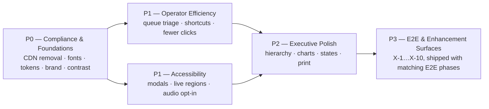

# UI/UX Improvement Plan — SHILA / TOS SLA Dashboard

> **Companion to:** `2026-07-19-e2e-sla-improvement-plan.md` (E2E SLA plan)
> **Document type:** UI/UX improvement plan — findings, principles, prioritized backlog, mockups
> **Status:** Draft for review

---

## 0. Document Control

| Item | Value |
| --- | --- |
| Version | 0.1 (draft) |
| Date | 2026-07-20 |
| Scope | Frontend (Angular 18, `frontend/src`) — visual design, interaction, accessibility, brand |
| Mockups | `docs/improvement-plan/mockups/ui-mockups.html` (before/after, self-contained HTML) |

### Decisions locked for this draft (confirmed with owner)

1. **Priorities:** Operator efficiency, Accessibility (WCAG), Executive polish. (Maintainability/mobile = supporting enabler only, not a driving goal.)
2. **Brand:** Align the UI to **Bank Mandiri brand** (deep blue + gold), replacing the current indigo/slate palette.
3. **Theme:** **Light only** for now; design tokens structured so dark mode can be added later without rework.
4. **Deliverable:** This document **plus** before/after visual mockups.
5. Inherited from the E2E plan: **P6 — no cloud, no GPU**; every asset must be served on-prem.
6. **E2E alignment:** this plan is the UI counterpart of the E2E plan — every E2E capability that reaches a screen (segments, typed pauses, provenance, committed-by promise, recovery cases, new roles, Enhancement Set 2 / Appendix E) has a surface defined here (§5 P3), and UI phases are synced to E2E phases (§6).

---

## 1. Why UI/UX Is a Business Item (not cosmetics)

- **Operator efficiency = SLA performance.** 23 people process thousands of transactions against 60–90-minute budgets. Every avoidable click, ambiguous status color, or slow scan of a queue table is SLA time burned. The UI *is* an operational lever.
- **Executive credibility.** The dashboard is the face of the 23% → 99% story for leadership and for replication (TOS Jakarta). Visual quality and Mandiri branding directly affect how trustworthy the numbers feel.
- **Reputational & compliance risk.** The app currently loads assets from the public internet (see F-1) — a data-boundary violation in spirit and a hard breakage in an air-gapped network. Accessibility is likewise an expectation for internal bank tooling.
- **Fairness & integrity.** Clear SLA countdowns and honest visual signals support the anti-gaming and fair-evaluation goals of the E2E plan.

## 2. Grounded Findings (from codebase audit)

| # | Finding | Evidence | Severity |
| --- | --- | --- | --- |
| F-1 | **Tailwind loaded from public CDN at runtime** — external cloud dependency; explicitly not-for-production build; breaks in air-gapped network | `src/index.html:9` → `https://cdn.tailwindcss.com` | 🔴 Critical |
| F-2 | **Google Fonts loaded from cloud** (`Inter` via `fonts.googleapis.com`) — second external runtime dependency | `src/styles.css:7` | 🔴 Critical |
| F-3 | **Accessibility is minimal** — ~24 `aria-*`/`alt`/`role` attributes across ~5,300 component lines; no focus trap in modals; no `aria-live` for real-time SSE updates | grep audit across `src/app` | 🟠 High |
| F-4 | **Palette is generic indigo/slate, not Mandiri brand** — `--accent: #6366f1` (indigo), sidebar slate-900 | `src/styles.css:9–35` | 🟠 High |
| F-5 | **Audio-only early-warning cue** (`suara_sapi.m4a` loop) — no visual-only alternative, unprofessional in open office, inaccessible to hearing-impaired staff | early-warning modal component; PRD §5.10 | 🟠 High |
| F-6 | **Color is the only signal** for SLA state in several places (green/yellow/red bars) — fails color-blind users; WCAG 1.4.1 | queue/status visuals | 🟠 High |
| F-7 | **Oversized single-file components with inline templates** — exec-dashboard 1,132 lines; all-lcs 883; queue 611; one 2,371-line global `styles.css`; 14/14 components inline-template | `wc -l` audit | 🟡 Medium (enabler) |
| F-8 | **Dev artifacts visible in the production UI** — mock role selector card sits in the sidebar; reset button in topbar | sidebar/topbar components | 🟡 Medium |
| F-9 | **Gold-on-white contrast trap** — Mandiri gold (~#FDB913) on white ≈ 1.9:1 contrast; unusable for text/critical indicators | brand-alignment constraint | 🟡 Design rule needed |
| F-10 | **No loading/empty/error state system** — data panels render blank or jump when SSE refreshes land | component review | 🟡 Medium |

## 3. Design Principles

- **U1 — On-prem assets only (extends P6).** Every font, style, script, and icon is built and served from the bank's infrastructure. Zero runtime calls to the public internet.
- **U2 — Seconds matter.** The queue is a work tool, not a report: optimize for scan speed, minimal clicks, and keyboard operation.
- **U3 — Never color alone.** Every state conveyed by color also carries a label, icon, or pattern (WCAG 1.4.1); target WCAG 2.1 AA contrast throughout.
- **U4 — Mandiri brand, used correctly.** Deep blue leads; **gold is an accent, never text on light backgrounds** (F-9). Exact brand values to be confirmed against the official brand guideline (Pantone → hex).
- **U5 — Calm urgency.** At-risk and breach states must be unmissable without being noisy: strong visual hierarchy instead of sound; audio becomes opt-in.
- **U6 — Tokens first.** All colors/spacing/type flow from CSS design tokens so brand alignment is a token swap and dark mode remains a future toggle, not a rewrite.
- **U7 — Show the promise and the proof.** The committed-by time (E2E App. E.1) is visible wherever the transaction is, and every timestamp carries its provenance (Eximbills-authoritative ✓ vs manual-provisional) — the UI makes trustworthy data *look* trustworthy and provisional data look provisional (E2E Pillar 1).
- **U8 — Compliance looks calm.** A compliance hold is styled as a neutral, informative state — never with warning/danger colors, countdowns, or urgency cues. The screen itself must not pressure a compliance decision (E2E principle P1).

## 4. Design Tokens (proposed)

Semantic tokens, light theme now, dark-ready structure. Brand hex values are **approximations pending the official guideline**:

```css
:root {
  /* Brand (to confirm vs official Mandiri guideline) */
  --brand-blue-900: #002B5C;  /* sidebar / headers */
  --brand-blue-700: #003D79;  /* primary actions, links */
  --brand-blue-500: #0057A8;  /* hover, secondary */
  --brand-blue-050: #EBF3FB;  /* selected rows, chips */
  --brand-gold-500: #FDB913;  /* accent ONLY: markers, active indicators, never text on light */
  --brand-gold-700: #C98F00;  /* gold usable on white for small accents if ≥3:1 needed */

  /* Semantic status (AA-checked, each paired with icon/label per U3) */
  --status-safe:    #0E7A46;
  --status-warning: #B45309;
  --status-danger:  #B91C1C;
  --status-info:    var(--brand-blue-700);

  /* Surfaces & text (unchanged spirit, re-based on brand neutrals) */
  --content-bg: #F6F8FB;  --card-bg: #FFFFFF;
  --text-primary: #0B1F35; --text-secondary: #51637A; --border: #DCE4EE;
}
```

Rules: status colors darkened vs today's `#f59e0b`/`#ef4444` to pass AA on white; sidebar moves from slate-900 to brand blue-900 with gold used only for the active-item indicator bar and the three-wave logo motif.

## 5. Prioritized Backlog

### P0 — Compliance & Foundations (mandatory, before anything else)

| ID | Item | Addresses |
| --- | --- | --- |
| P0-1 | **Remove Tailwind CDN**: adopt a proper Tailwind build (PostCSS, purged) **or** drop Tailwind and keep the existing custom CSS (already carries most styling). Decision spike, then execute | F-1, U1 |
| P0-2 | **Self-host fonts**: bundle Inter (woff2, `font-display: swap`) or fall back to a system stack; remove `@import` to Google | F-2, U1 |
| P0-3 | **Introduce design tokens** (§4) in a dedicated `tokens.css`; refactor `styles.css` to consume them | U6, F-4 |
| P0-4 | **Brand alignment pass**: apply Mandiri palette per U4 — sidebar, buttons, links, chips, charts, logo usage | F-4, F-9 |
| P0-5 | **Contrast audit** of every text/background and status pair to WCAG 2.1 AA; fix failures (incl. gold rules) | F-3, F-6, U3 |

### P1 — Operator Efficiency (the queue is the product)

| ID | Item | Detail |
| --- | --- | --- |
| P1-1 | **At-risk-first queue** | Default sort = time-to-SLA ascending (risk-based triage made physical); sticky table header; density toggle (comfortable/compact) |
| P1-2 | **One-glance SLA cell** | Countdown chip combining remaining time + % bar + icon (not color-only); breach shows elapsed-over by how much |
| P1-3 | **Keyboard-first actions** | `j/k` row navigation, `Enter` detail, single-key advance (e.g. `S` start, `R` release w/ confirm), `/` focus search; shortcut help via `?` |
| P1-4 | **Fewer clicks per transition** | Inline confirm (no modal) for start-type actions; optimistic UI with SSE reconciliation; undo toast for 5s instead of blocking confirms where safe |
| P1-5 | **Quick filters as chips** | One-tap: At-risk · Breached · Mine · Exception · Per-type; replaces dropdown digging |
| P1-6 | **Bulk selection** | Multi-select for bulk exception-marking / bulk assign (respecting per-row legality) |
| P1-7 | **Row context surface** | Hover/focus reveals assignee load and last event inline, avoiding modal round-trips |
| P1-8 | **Create-order form speed** | Autofocus first field, URN format hint + inline uniqueness check, sensible tab order, `Ctrl+Enter` submit |

### P1 — Accessibility (WCAG 2.1 AA)

| ID | Item | Detail |
| --- | --- | --- |
| A-1 | **Modal a11y** | Focus trap, `Esc` close, focus return, `role="dialog"` + labels for detail/early-warning/login modals |
| A-2 | **Live-region updates** | `aria-live="polite"` announcements for SSE-driven changes ("URN 123 moved to Checking") — also fixes silent jumps (F-10) |
| A-3 | **Early-warning without audio** | Visual-first alert (full-screen stays), **audio off by default / opt-in per user**; add title-bar flash + favicon badge; respects `prefers-reduced-motion` | 
| A-4 | **Icons + labels on all statuses** | Status pills gain icons and text everywhere color is used (queue bars, KPI cards, charts) |
| A-5 | **Keyboard reachability** | Full tab order over interactive surfaces incl. sortable headers; visible focus ring (brand blue, 2px) |
| A-6 | **Screen-reader table semantics** | Proper `th/scope`, caption, and row-action labels on queue/all/event tables |

### P2 — Executive Polish

| ID | Item | Detail |
| --- | --- | --- |
| E-1 | **Information hierarchy pass** | One primary KPI row (E2E compliance headline once E2E ships), secondary metrics grouped; consistent number/percent/duration formatting (single formatter util) |
| E-2 | **Chart clarity** | Direct labels over legends where possible; brand-consistent series colors with per-type icons; axis/tooltip formatting; SLA target line drawn on duration charts |
| E-3 | **Skeleton + empty + error states** | System-wide: skeleton cards on load, informative empty states ("No breaches this period 🎉"), retry-able error panels — kills blank/jumping panels (F-10) |
| E-4 | **Executive print/PDF view** | Clean print stylesheet for the dashboard (management circulates PDFs); complements the Excel export |
| E-5 | **Demo-clean chrome** | Hide mock-role card & reset button behind a dev flag (F-8); topbar shows environment badge only in non-prod |
| E-6 | **Micro-branding** | Mandiri three-wave motif as subtle header accent; consistent favicon/logo; ID/EN copy review pass |

### P3 — E2E & Enhancement Surfaces (synced to the E2E plan)

Every screen-reaching capability of the E2E plan and its Enhancement Set 2 (Appendix E), designed under U7/U8. Ships **with** the E2E phase that delivers the backend capability — see §6.

| ID | Surface | Detail | E2E ref |
| --- | --- | --- | --- |
| X-1 | **End-to-end journey timeline** | Detail modal timeline extends to Intake → BU Review → Ops stages → Released → SWIFT chip; segments rendered as owned blocks (TSC/BU/Ops) with sub-SLA ticks and breach attribution ("late because Review took 3×") | §11, §13.3 |
| X-2 | **Typed pause UI** | Pause/resume replaces the single-exception flow: Customer ⏸ (amber-neutral), External 🌐 (neutral), **Compliance 🛡 (calm neutral per U8 — no urgency styling, no countdown)**; paused rows show "clock paused — resumes …" with business-calendar awareness | §11.3, §16 |
| X-3 | **Provenance badges** | Every timestamp shows source: ✓ Eximbills (authoritative) vs ◌ manual (provisional, visibly lighter); discrepancy icon when both exist; override action gated + reason field (audit) | §12, U7 |
| X-4 | **Committed-by promise chip** | Queue + detail show the communicated ETA distinctly from the internal budget; ETA-at-risk state fires *before* the external promise is threatened (buffer per E.1) | App. E.1 |
| X-5 | **Recovery case panel** | Breach opens a guided checklist card (exec notified → RM contact w/ timer → root-cause tag → action → close); open-cases widget on exec dashboard with time-to-contact | App. E.2 |
| X-6 | **Cut-off cockpit strip** | Queue-top banner: "N must complete before 15:00 cut-off" with distinct styling from SLA-at-risk (different icon + label per U3) | App. E.4 |
| X-7 | **New role screens** | TSC intake screen (register + requirements checklist E.5), BU decision screen (approve / return / reject with handoff stamps), compliance hold controls (compliance_officer only) | §13, §18 |
| X-8 | **Escalation-aware notifications** | Notification center gains **acknowledge / snooze-with-reason**; escalation level visible (staff → officer → manager); early-warning modal gains ack button (audio stays opt-in per A-3) | §19.1 |
| X-9 | **Quality & fairness indicators** | Rework badge on bounced rows + FTR% in performance tables (E.3); tier marker as subtle tie-break chip **without** queue-jumping visuals (E.7); CSAT tile on exec dashboard (E.6) | App. E.3/6/7 |
| X-10 | **Site & stranded states** | Site switcher for multi-site scoping (E.8); "stranded — no owning unit" row state with alert styling | App. E.8, §13.2 |

### Supporting (enabler, scheduled opportunistically)

| ID | Item | Detail |
| --- | --- | --- |
| S-1 | Split the three largest components (exec-dashboard 1,132 / all-lcs 883 / queue 611 lines) into child components with extracted templates — makes P1/P2 work safe and reviewable (F-7) |
| S-2 | Break `styles.css` (2,371 lines) into `tokens.css` + per-area layers; component-scoped styles for new components |
| S-3 | Tablet ergonomics only where operators actually use tablets; no dedicated mobile redesign this cycle |

## 6. Phasing & Effort Shape



P0 is small but blocking (asset pipeline + tokens). P1 efficiency and P1 accessibility can run in parallel after P0. S-1/S-2 land as the first touch of each large file, not as a separate refactor project.

**P3 ↔ E2E phase sync** (a surface ships in the same release as its backend capability):

| E2E plan phase | UI surfaces that ship with it |
| --- | --- |
| E2E Phase 1 — Data Integrity | X-3 provenance badges (+ override UI) |
| E2E Phase 2 — End-to-End SLA | X-1 journey timeline · X-2 typed pauses · X-7 role screens · X-10 site/stranded · X-9 FTR/rework |
| E2E Phase 3 — Customer Transparency | X-4 committed-by chip · X-8 escalation notifications · X-9 CSAT tile |
| Recovery mini-phase (E2E App. E.10) | X-5 recovery panel · X-6 cut-off strip · X-9 tier chip |

UI phases P0–P2 have no E2E dependency and should **not wait** for it; P3 items must **not ship ahead** of their backend capability (a promise chip without a real committed-by calculation would be theater).

## 7. Success Metrics

| Metric | Baseline | Target |
| --- | --- | --- |
| Runtime requests to public internet | 2 (Tailwind CDN, Google Fonts) | **0** |
| Median clicks per status transition | ~2–3 (button + modal) | 1 (+ undo) |
| Time for operator to find most-at-risk item | scan/sort manually | < 2 s (default sort + chip) |
| WCAG 2.1 AA automated audit (axe) violations | untracked (est. high) | 0 critical / near-zero serious |
| Modal keyboard operability | none | 100% (trap/Esc/return) |
| Early-warning audio complaints in open office | anecdotal | 0 (opt-in audio) |
| Exec dashboard first-paint blank panels | present | 0 (skeletons everywhere) |
| Timestamps displaying provenance (X-3) | 0% | 100% once E2E Phase 1 ships |
| Compliance-hold rows using urgency styling (U8 violation) | n/a | 0, verified by design review |
| Alerts acknowledged (not expired) in notification center (X-8) | untracked | ≥ 90% |

## 8. Risks & Notes

| Risk | Mitigation |
| --- | --- |
| Exact Mandiri hex values differ from approximations | Token swap only (U6); confirm against official brand guideline before P0-4 sign-off |
| Removing Tailwind CDN silently changes styling that depended on Tailwind utilities | P0-1 starts with a usage inventory (grep class usage) → choose "proper build" vs "drop Tailwind"; visual regression pass on all routes |
| Keyboard shortcuts collide with browser/screen-reader keys | Follow WAI-ARIA authoring practices; shortcuts disabled while focus is in inputs; `?` overlay documents them |
| Optimistic UI vs SSE race (P1-4) | Reconcile on `lc_update`; server remains source of truth; undo window only for reversible transitions (per existing backward-transition matrix) |
| Brand refresh perceived as "new tool" by trained staff | Layout/flows unchanged in P0; colors first, interaction changes arrive with release notes + shortcut overlay |

## 9. Mockups

Before/after mockups for the two highest-traffic screens live at
`docs/improvement-plan/mockups/ui-mockups.html` — self-contained single file (no external assets, per U1), openable in any browser:

1. **Queue (operator)** — before: current indigo UI, color-only bars, modal-heavy actions; after: Mandiri brand, at-risk-first sort, SLA countdown chips with icons, quick-filter chips, keyboard hints.
2. **Executive dashboard (header + KPI band)** — before: current layout; after: brand header, primary-KPI hierarchy, skeleton/empty-state examples, AA status colors.
3. **E2E transaction detail (new surface)** — the P3 flagship in one frame: segment journey bar (Intake/Review/Processing) with a calm compliance pause, committed-by promise chip, provenance badges (Eximbills ✓ vs manual ◌), SWIFT chip, and a recovery-case strip.
4. **Token strip** — the proposed palette with contrast annotations.

Mockups are illustrative of direction, not pixel specs.

## 10. Open Assumptions

1. **Official Mandiri brand values** (Pantone→hex, logo usage rules) — confirm against the internal brand guideline before P0-4 sign-off.
2. **Tailwind usage depth** — inventory decides P0-1 path (proper build vs removal); current custom CSS appears to carry most styling.
3. **Operator hardware** — assumed desktop-first with occasional tablet; no dedicated mobile redesign this cycle (S-3).
4. **Audio-alert policy** — assumed opt-in is acceptable to ops leadership given escalation ladder (E2E plan §19) now guarantees follow-up.
5. **P3 surface timing** — assumed the E2E plan's phases land in the stated order; if an E2E phase re-sequences, its X-items move with it (§6 sync table is the source of truth).
6. **Customer-facing UI (KOPRA status page)** is owned by the KOPRA/channel team — this plan covers only the *internal* dashboard surfaces; milestone naming (E2E §14.1) is shared vocabulary between both.
